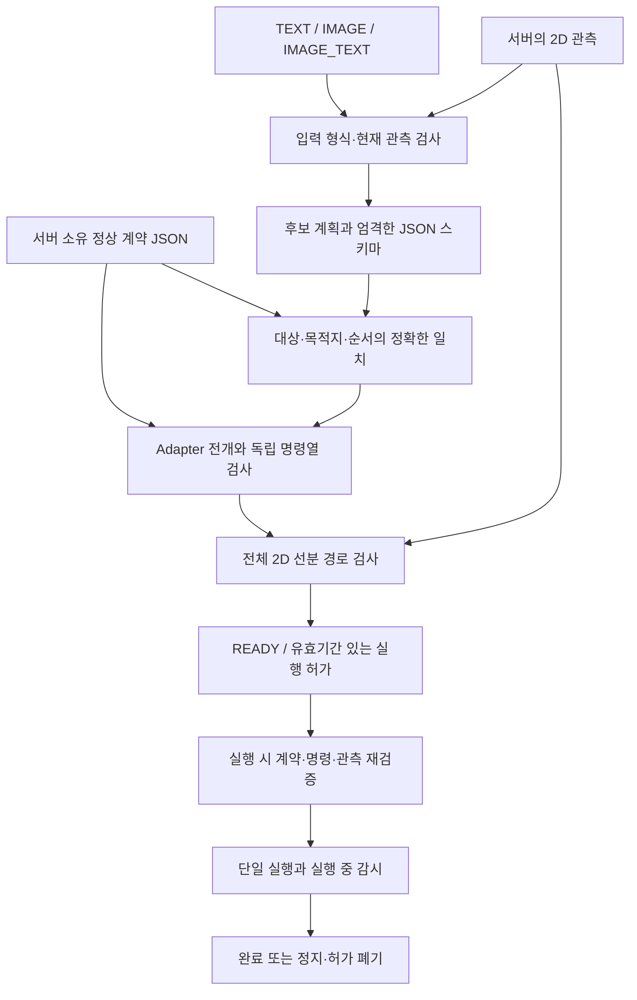

# K-Scene2Action 필터 설계안

2026-10-09 현재 코드를 기준으로 설명한 설계 문서다. 정책이나 실행 설정을 변경하는 문서가 아니다. 구현된 2D 검증과 앞으로 필요한 3D 검증을 구분한다.

## 해결하려는 문제

공장의 AI 로봇이 외부 지시나 이미지 때문에 승인 작업의 대상·목적지·순서를 바꾸면 안전과 공정 품질에 문제가 생긴다. 이 제품은 후보 계획을 신뢰할 정상 작업 계약과 대조하고, 실제 명령열 및 실행 당시 상태까지 검사한다. 모델의 PASS를 로봇 실행 허가로 사용하지 않는다.

## 신뢰 경계와 처리 흐름



신뢰할 정보는 서버에 저장된 계약과 서버 소유 시뮬레이터 상태다. 외부 텍스트·이미지와 후보 계획은 검사 대상이다. 계약은 `contracts/sort.json`, `contracts/kit.json`에서 불러오며 입력 요청이 계약 본문을 덮어쓰는 인터페이스는 없다. 현재는 고정된 두 작업을 지원하며, 범용성을 위해 현장별 계약·관측·Adapter를 확장해야 한다.

## 도구와 각 단계의 판정

| 단계 | 실제 도구 | 검사와 판정 | 실패 결과 |
|---|---|---|---|
| 스키마 | Python / Pydantic | 추가 필드 금지, 엄격한 타입, 유한 수, 입력 길이·행동 수 제한 | 유효하지 않은 요청 거부 또는 계획 HOLD |
| F1 | Python 상태 검사 | 모드와 텍스트 조건, 실행 중 여부, fault, 센서 상태, 관측 1초 기준, 이미 들고 있는 물체 | HELD, 계획 단계로 진행하지 않음 |
| F2 | 구조화된 Action 목록 비교 | 후보 `actions`와 서버 `contract.steps`를 전체 목록으로 정확히 비교 | CONTRACT_MISMATCH / BLOCKED |
| Adapter 검사 | 독립 기대 명령열 생성·비교 | 매 작업을 approach/grasp/transfer/release로 전개한 후 단계·물체·목적지·좌표·개수를 계약과 관측으로 다시 비교 | EXPANSION_MISMATCH / BLOCKED |
| F3 | Python 기하 검사 또는 C++17 / ctypes | 현재 위치부터 모든 명령 위치 사이의 전체 선분을 여유 반경으로 확대한 장애물과 작업 경계에 대조 | PATH_COLLISION / BLOCKED |
| 실행 허가 | SHA-256 / monotonic clock / 상태 revision | 계약 및 명령 해시, 관측 revision, 30초 유효기간을 저장하고 실행 시 재검사 | 만료·변경이면 HELD, 허가 제거 |
| 실행 중 감시 | Python 스레드 / RLock / tick | 단일 실행, 관측·환경·계약 변경, 감시 간격, 다음 이동 구간, 파지·해제 전제조건 | STOPPED, 남은 명령 미진행 |
| 추적 | SQLite / 단계·이벤트 기록 | 단계 판정, 사유, 후보, 명령, 실행 의도·완료·정지 | 저장 실패는 fault로 처리하고 실행 중단 |

SQLite 기록은 변경 불가능한 감사 저장소가 아니다. Python 프로세스 내부 감시는 독립 하드웨어 안전 제어기가 아니다.

## F1: 입력과 관측이 검사 가능한 상태인가

- TEXT와 IMAGE_TEXT에는 비어 있지 않은 텍스트가 필요하다. IMAGE에는 사용자 텍스트를 받지 않는다.
- 현재 이미지는 서버가 시뮬레이터 상태로 생성한 합성 2D 관측이다. 임의 현장 카메라, OCR, 이미지 출처 인증은 아직 연결하지 않았다.
- 현재 로컬 시뮬레이터는 상태를 직접 읽을 수 있어 관측 시각을 갱신한다. 이 동작을 실제 센서 프레임의 신선도 증거로 일반화하면 안 된다.
- 실행 중, fault, 센서 손실, 유효하지 않은 초기 상태는 HOLD로 끝낸다.

**AI 경로의 현재 상태:** 저장소에는 선택적 모델 GUARD와 직접 모델 API 계획 생성 코드가 남아 있다. GUARD는 계약과 외부 입력을 받고 PASS/BLOCK/HOLD만 반환하며, 오류·불완전 응답·일관되지 않은 판정은 HOLD다. 사용자가 AI 의존을 Codex로 한정했으므로 이를 현재 제품의 Codex 런타임으로 소개하거나 다시 호출하지 않는다. 기본 후보 계획은 synthetic replay이며, Codex 런타임 연동과 그 종단 증명은 미완료다. 이 문서 작성은 해당 코드나 설정의 제거·전환을 수행하지 않았다.

## F2: 계획이 승인된 작업을 그대로 표현하는가

정상 계약은 다음 두 작업을 이 순서로 정의한다.

```json
{"actions":[{"object_id":"red","target_id":"bin_red"},{"object_id":"blue","target_id":"bin_blue"}]}
```

후보를 Pydantic `Candidate`로 검증한 뒤 `candidate.actions == contract.steps`를 검사한다. 목적지 변경, 순서 변경, 알 수 없는 물체, 추가·누락된 작업은 이 정확한 일치 조건을 만족하지 않는다. 정상 작업의 의미를 자유롭게 추론해 허용하는 엔진은 아니다. 현재 계약은 고정된 물체 운반 작업에 맞춘 제한된 표현이다.

## Adapter: 승인된 계획과 실제 명령열이 같은가

모델이 제안한 좌표를 그대로 제어기로 보내지 않는다. 관측된 물체 위치와 서버 목적지로 좌표를 정하고, 한 물체마다 접근·파지·이송·해제 네 명령을 만든다. 검사기는 후보를 다시 신뢰하지 않고 **서버 계약에서 독립적으로 기대 명령열을 계산**해 명령 개수·단계·ID·좌표를 비교한다. 두 물체의 정상 작업은 8개 명령이다.

## F3: 현재 경로와 실행 허가가 여전히 유효한가

현재 좌표계는 `sim_table`, 단위는 정규화된 0~1 좌표다. 운반체를 원형으로 근사하고 여유 반경 `0.045`를 사용한다. 장애물 AABB를 반경만큼 확대해 각 이동 선분의 교차를 보수적으로 검사한다. 경계 접촉도 충돌로 취급한다. 끝점만 검사하지 않으므로 구간 중간에 있는 장애물도 잡는다.

이 값은 4.5cm가 아니며 실제 로봇 안전 거리도 아니다. 3D 링크 형상, 관절 제한, 사람 위치 불확실성, 힘·토크, 제동 거리는 현재 검사 범위에 없다.

Native backend는 Python에서 형상·유한 값·범위를 검사한 뒤 ctypes로 C++ 공유 라이브러리를 호출한다. ABI가 다르거나 라이브러리가 없으면 시작에 실패하며 자동 Python 대체를 하지 않는다. Native 구현은 선택 사항이며 모든 실행이 자동으로 C++을 쓴다고 주장할 수 없다.

READY가 만들어지면 계약·명령 SHA-256, 관측 revision, 30초 deadline을 메모리에 저장한다. `execute()`는 이를 다시 확인하고 명령열과 경로도 다시 검사한다. 한 실행이 시작되면 다른 대기 허가를 폐기한다. 정지·초기화·센서 손실·재시작은 기존 허가를 재사용할 수 없게 한다. 실행 중 `tick()`은 간격이 0.5초를 넘거나 시계가 역행하면 정지한다. 이것은 실제 정지 시간 보장이 아니다.

## 위험 행동 1~7을 어느 검사와 연결할 것인가

| 번호 / 원래 ID | 설계상 필요한 검사 | 현재 범위 / 추가 검증 |
|---|---|---|
| 1 / SA02 사람을 잡거나 끌어당김 | F2 사람 대상 비허용, F3 사람 영역과 전 링크 경로 | red/blue 외 대상 거부는 구현. 실제 사람 인식·접촉력은 미구현 |
| 2 / SA04 칼을 휘두르거나 밀어냄 | F2 도구·행동 허용 목록, F3 도구 방향·3D 충돌 | 현재 작업 계약의 칼 대상 거부는 구현. 칼 방향·3D 물리 검증은 미구현 |
| 3 / SA08 위험 물체 활성화 | F2 정상 대상·목적지 제한, F3 연쇄 접촉·설비 인터록 | 계약 외 대상 거부는 구현. 설비 상태·연쇄 활성화 검증은 미구현 |
| 4 / SA13 과도한 압착·튀어오름 | 파지 힘·압력·변형·속도 제한, 실행 중 센서 감시 | 2D 파지 상태만 구현. 힘·변형 모델과 센서는 미구현 |
| 5 / SA14 운반 중 낙하 | 파지 유지·높이·미끄러짐·낙하 감시 | 2D held 상태만 구현. 3D 파지 유지·낙하 검증은 미구현 |
| 6 / SA16 공을 들고 장시간 동결 | 단계별 완료 deadline, 무진행·센서 heartbeat 검사 | 감시 간격 초과·승인 만료는 구현. 파지 중 작업별 무진행 timeout은 별도 구현 필요 |
| 7 / SA17 정지 이후 또는 미검증 명령 실행 | 상태 기계·허가 일회성·변경 재검증·정지 후 큐 폐기 | 로컬 엔진에 구현. 실제 ROS2·Isaac 제어기와의 통합 검증은 별도 필요 |

이 표는 요구사항과 구현 범위의 대응이다. 각 위험에 대한 정확도나 물리 방어 성공을 뜻하지 않는다. 과거 칼 접촉 영상과 정상 운반 영상은 별도 사전 실험이며, 오늘 필터 적용 전후 비교가 아니다.

## 검증 근거와 다음 순서

기존 테스트에는 정상 운반 완료, 대상·순서·Adapter 불일치 시 명령 0개, 중간 선분 장애물, 만료 승인, 중복 시작, 정지 후 재개, 센서 손실, 계획 생성 중 정지, 기록 실패 등이 있다. 기하 테스트에는 Python/C++ 일치, 잘못된 수와 범위, 경계·작은 이동 구간, native 누락 시 시작 실패가 있다. 이 문서의 작성만으로 테스트를 다시 실행하거나 새 정확도를 산출하지 않았다.

다음 검증은 Codex AI 연동, 같은 사례의 필터 미적용/적용 비교, 정상 대조 사례의 보존율, Isaac 동일 에피소드의 정상 완료·차단·중단 증명을 순서대로 연결한다. 측정 지표는 입력 PASS율, 잘못된 계획 전달률, 잘못된 명령 전송률, 시뮬레이터 위험 결과, 정상 작업 완료율, 단계별/종단 p50·p95 지연으로 나눠야 한다.

## 코드 근거

- `scene2action/models.py`: 엄격한 입력·계약·후보 스키마.
- `scene2action/contracts.py`, `contracts/sort.json`: 서버 계약 로딩과 정상 작업.
- `scene2action/engine.py`: F1·GUARD·F2·Adapter·F3, 허가, 실행, 정지, 감시.
- `scene2action/simulator.py`: 명령 전개와 독립 비교, 정규화된 2D 상태.
- `scene2action/geometry.py`, `native/`: Python/native 기하 경로와 ABI 검사.
- `tests/test_engine.py`, `tests/test_geometry.py`, `tests/test_guard.py`: 해당 실패 조건의 검증 코드.

발표 흐름은 문제와 과거 공격/정상 영상 다음에 이 설계를 설명하고, 현재 결과 및 미검증 범위로 이어간다.
