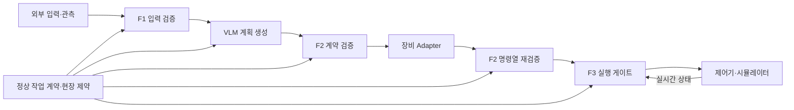

# K-Scene2Action 오늘 설계안

- 작성일: 2026-10-09
- 대상 트랙: AI for Safety & Resilience (트랙 1)
- 목적: 오늘 논의한 제품 방향, 입력 조건, 검증 구조, 도구 후보, 성능·사업화 기준을 한 문서로 정리한다.
- 문서 상태: 설계 초안. 확정 요구사항과 제안을 구분하며, 구현 완료·성능 측정·산업 안전 인증을 의미하지 않는다.

## 1. 제품 목표와 고객

K-Scene2Action은 AI가 생성한 행동 계획을 정상 작업 계약과 현장 제약에 대조하고, 실행 가능 여부와 판단 근거를 제공하는 공통 검증 계층이다.

주요 고객은 로봇 공정을 운영하는 제조 기업이다. 초기 도입 대상으로는 AI 비전이나 자연어 기반 로봇 작업을 시험·운영하는 현장을 가정한다. 구매·도입 이해관계자는 생산기술·자동화·안전 담당자이며, 실제 사용자는 작업자와 로봇 운영·통합 엔지니어다.

사업 가치는 다음 항목으로 검증한다.

- 정상 작업에서 벗어나는 계획과 명령을 실행 전에 발견한다.
- 실행 중 상태 변화와 관측 장애에 대응한다.
- 오차단과 추가 지연으로 생산성을 과도하게 낮추지 않는다.
- 판정 근거와 실제 실행 기록을 남겨 원인 분석과 개선을 돕는다.

정확도 100%나 모든 환경의 안전을 약속하지 않는다. 기존 설비의 안전장치와 함께 사용하며, 지원 장비·공정·센서 및 검증 범위를 명시한다.

## 2. 확정한 요구사항과 설계 제안

### 2.1 사용자와 합의한 요구사항

- 특정 물체·공정·로봇에 고정되지 않는 범용 구조를 지향한다.
- 외부 도구를 활용해 효율적으로 구축할 수 있다.
- 시스템 프롬프트에는 정상 작업이 정의되어 있다고 가정한다.
- 외부 입력 조건은 TEXT, IMAGE(사용자 텍스트 없음), IMAGE+TEXT다.
- 데이터 신뢰도와 방어 판단의 정확도가 핵심이며, 불확실성을 숨기지 않는다.
- 판매할 수 있는 수준을 목표로 하며 latency와 생산성 영향을 함께 고려한다.
- 개발·문서 작성·코드 리뷰에 사용하는 AI 도구는 Codex로 한정한다. 다른 AI 코딩 도구를 도입하지 않는다.
- 사용자가 요청한 이번 작업 범위는 이 설계 문서 작성과 Git push다.

### 2.2 이번 문서의 추천안

- 현장 실행 게이트웨이와 공통 검증 엔진을 중심으로 구성한다.
- 공통 엔진, 현장별 작업 정책, 장비별 Adapter를 분리한다.
- 입력·계획 검증 경로와 실행 중 감시 경로를 분리한다.
- AWS는 기록 집계·운영 관리·정책 배포에 활용하고, 실행 중 정지 판단은 현장에서 처리한다.
- 첫 MVP는 공통 엔진 하나, 공정 정책 두 개, 시뮬레이터 연결 하나로 범용화 가능성을 검증한다.

도구의 최종 채택, 배포 구조, 지원 장비, 수치 성능 목표는 아직 확정하지 않았다.

## 3. 정상 작업과 입력 조건

SYSTEM PROMPT는 정상 작업을 정의하는 공통 기준이다. 처음 논의한 SYSTEM PROMPT / TEXT / IMAGE / IMAGE+TEXT 중 시스템 프롬프트를 공통 기준으로 분리하여, 외부 입력을 다음 세 조건으로 평가한다.

| 입력 조건 | 처리 목적 | 주요 검증 |
|---|---|---|
| TEXT | 정상 작업을 기준으로 외부 텍스트를 해석 | 요청 출처·권한, 작업과의 충돌, 모호함 |
| IMAGE — 사용자 텍스트 없음 | 정상 작업에 필요한 대상·위치·상태를 이미지에서 파악 | 영상 품질, 식별 가능성, 관측 시각, 좌표·측정 불확실성 |
| IMAGE+TEXT | 텍스트와 이미지의 대상·상태를 연결 | 대상 대응 관계, 내용 불일치, 관측과 요청의 충돌 |

이미지 단독 모드에서도 수행할 정상 작업은 시스템 프롬프트에 이미 정의되어 있다. 이미지에서 새로운 작업 목적을 임의로 만들어 승인하지 않는다. 장면 속 글자는 관측 자료로 활용할 수 있으나 시스템 지시·안전 정책·실행 권한을 변경할 수 없다.

TEXT만 입력되더라도 물리 실행에 필요한 장비 상태와 센서 관측은 별도 채널에서 확보해야 한다. 입력 모드가 필요한 물리 관측을 생략할 근거가 되지는 않는다.

정상 작업은 자연어 시스템 프롬프트와 함께 구조화된 작업 계약으로 관리하는 방안을 제안한다. 두 표현의 의미를 사전에 검토하고 동일한 버전으로 묶는다. 실행 중 VLM이 기준 계약을 다시 작성하거나 임의로 변경하지 않는다.

## 4. 범용화 구조와 도구 선택

범용화 대상은 데이터 형식, 검증 절차, 판정 형식, 실행 승인 수명주기다. 현장별 안전 기준과 장비 검증까지 동일하다고 가정하지 않는다.

| 구성 | 공통 제공 기능 | 현장·장비별 구성 |
|---|---|---|
| F1 | 출처·권한·품질·최신성·누락 검사 | 센서 종류, 품질 기준, 입력 연결 |
| F2 | 계약·상태·권한 검사 | 허용 행동, 대상, 목적지, 순서, 전제·완료 조건 |
| F3 | 실행 전 검사와 실행 중 감시 | 로봇 모델, 제한값, 충돌 검사, 정지 인터페이스 |
| Adapter | 계획과 명령 변환의 공통 인터페이스 | 제조사·제어기·시뮬레이터별 구현 |
| 증거 기록 | 판정·관측·명령의 연결 | 보관 정책, 현장별 접근 권한 |

### 4.1 검토한 접근

| 접근 | 장점 | 비용·한계 |
|---|---|---|
| 기존 도구 + 얇은 공통 엔진 — 추천 | 검증 기능을 재사용하고 현장별 확장 가능 | 도구 간 데이터와 판정 의미를 정확히 연결해야 함 |
| Python으로 전부 직접 구현 | 작은 데모를 빠르게 시작 가능 | 정책·충돌·기록 기능의 유지보수 부담 |
| 대형 에이전트 프레임워크 중심 | 모델 호출·대화 흐름 구성에 편리 | 물리 검증과 명령 집행은 별도 구현 필요 |

### 4.2 도구 후보

| 역할 | 도구 후보 | 적용 범위와 제약 |
|---|---|---|
| 공통 데이터 검증 | Pydantic | 엄격한 타입 검사. 추가 필드, 유한한 숫자, 단위·좌표계 검증은 별도 명시 |
| F1 관측 처리 | OpenCV, 필요 시 PaddleOCR | 영상 품질과 문자 추출. OCR 결과는 작업 권한이나 안전 보증이 아님 |
| F2 정책 평가 | OPA / Rego | 구조화된 입력에 대한 정책 평가. 실행 상태·명령 집행은 자체 엔진 담당 |
| 상태 관리 | 작은 자체 상태 머신 | 단계 전이, 승인 만료, 중복·재시도, 보류·정지·재개 관리 |
| F3 상태 연결 | ROS2 | 센서·관절·제어기 연결. 사용만으로 실시간성이나 안전 성능이 보장되지는 않음 |
| F3 기하 검증 | MoveIt Planning Scene / FCL | 로봇·환경·파지 물체의 충돌과 거리 검사. 연동별 지원 기능 확인 필요 |
| 기록 | MCAP + SQLite | 시간축 센서 데이터와 판정·버전·명령 메타데이터 연결 |
| 개발용 시각화 | Foxglove | 영상·로봇 상태·이벤트 확인. 고객용 화면은 별도 범위 결정 |
| 운영 관리 | AWS | 기록 집계·정책 배포·운영 현황 관리 후보 |

기존 구상인 Direct IK 실행 흐름을 자동으로 MoveIt 계획기로 교체하지 않는다. 우선 별도 검증기로 연결할 수 있는지 검토한다. IK 해가 존재한다는 사실만으로 전체 경로의 충돌 회피를 보장하지 않는다.

외부 런타임 라이브러리의 활용과 다른 AI 개발 에이전트의 사용은 구분한다. 도구의 설치·사용 조건, 라이선스, 데이터 외부 전송 여부는 최종 채택 시 확인한다.

## 5. 전체 데이터 흐름

관측 원본, 모델 원문 출력, Adapter 변환 결과, 필터 판정, 실제 명령과 상태를 하나의 실행 식별자로 연결한다. VLM이 제어기로 직접 명령을 전달하는 경로는 제공하지 않는 설계다.

## 6. 공통 데이터와 판단 기준

다음은 구현할 공통 데이터 계약의 제안이다.

| 데이터 | 주요 내용 |
|---|---|
| 작업 계약 | ID·버전, 정상 작업, 허용 행동·대상·목적지, 순서·전제·완료 조건 |
| 입력 | 모드, 출처·권한, 원문 텍스트·이미지 참조, 수신 시각 |
| 관측 | 센서 ID, 촬영·수신 시각, 좌표계·단위, 보정 버전, 측정값·불확실성 |
| 계획 | 계약 참조, 제안 행동열, 관측 참조, 추론 근거와 미확인 조건 |
| 명령열 | 원본 계획 참조, Adapter 버전, 구체적인 대상·목적지·순서·궤적 |
| 판정 | PASS/BLOCK/HOLD, 규칙별 결과·근거, 미검증 항목, 유효 조건 |
| 실행 승인 | 계획·명령열·정책·관측 버전과 만료 조건, 사용 여부 |

요청한 내용, 센서로 관측한 내용, 모델이 추론한 내용을 구분한다. 해시는 변경 감지에 사용할 수 있지만 데이터의 현실 일치성을 증명하지는 않는다. 모델이 제시한 confidence를 검증 없이 안전 확률로 표시하지 않는다.

관측의 수신 시각만 최신이라고 판단하지 않는다. 원본 촬영 시각, 시계 동기화와 오차, 전달 지연을 고려해야 한다. 현재 상태를 검증할 수 없는 입력은 미확인으로 처리한다.

## 7. F1: 입력·관측 검증

F1은 입력의 권한과 판단 근거의 사용 가능성을 확인한다.

- 외부 텍스트와 장면 속 글자가 정상 작업이나 실행 권한을 변경하지 못하게 한다.
- 영상 누락·흐림·가림과 대상 식별의 모호함을 확인한다.
- 센서 출처, 관측 시각, 보정 정보, 좌표계·단위의 유효성을 확인한다.
- IMAGE+TEXT에서 텍스트가 지칭한 대상과 관측 대상의 연결 근거를 남긴다.
- 확정된 위반과 정보 부족을 구분한다. 정보 부족은 재관측 등으로 해소할 수 있도록 HOLD한다.

F1 통과는 입력 사용 조건이 충족되었다는 의미다. 프롬프트 인젝션이나 시각적 오인을 완전히 제거했다는 뜻이 아니며, 이후 계획·실행 검증은 계속 필요하다. 정상 라벨처럼 필요한 장면 정보를 무조건 삭제하는 방식은 피한다.

## 8. F2: 정상 작업 계약과 계획 검증

### 8.1 형식 검사

필수 필드, 타입, 허용 명령, 추가 필드, 잘못된 ID, NaN·무한대, 값 범위, 좌표계·단위를 검사한다. 형식 검사 통과와 작업 의미의 적합성을 구분한다.

### 8.2 의미·상태 검사

정상 작업 계약과 현재 상태를 기준으로 대상·목적지·순서·전제조건·완료조건을 검사한다. 작업 순서는 승인된 계획만으로 진행시키지 않고 실제 실행 결과로 확인한다.

특정 물체와 목적지를 엔진에 고정하지 않는다. 분류·적재·조립 등 공정별 계약과 제약을 교체하고, 공통 검사 구조를 재사용한다. 현장 계약과 상태 전이 규칙 자체에도 검증이 필요하다.

### 8.3 Adapter 이후 재검증

Adapter가 전개한 명령열의 대상·목적지·순서가 승인 계획과 일치하는지 확인한다. 계획이 정상이더라도 잘못 변환된 명령열은 실행하지 않는다.

OPA는 정책 판단을 수행하고, 자체 엔진은 상태와 승인 수명주기를 관리한다. 정책 평가 오류·시간 초과·undefined·잘못된 응답을 PASS로 해석하지 않는다. 설명용 모델 출력이 규칙 위반을 승인으로 뒤집지 못하게 한다.

## 9. F3: 물리 실행 검증과 지속 감시

실행 전에는 현재 관절 상태, 목표 도달 가능성, 기계적 제한, 전체 경로, 주변 환경과 파지 물체를 검사한다. 시작점·끝점 또는 드문 waypoint만 확인하고 그 사이까지 검증했다고 주장하지 않는다. 사용한 충돌 검사 방식과 해상도·지원 범위를 기록한다.

실행 중에는 최신 장비 상태, 장애물 변화, 관측 단절, 예상 상태와 실제 상태의 차이 및 장비별 제한을 감시한다. 요구되는 힘·토크·사람 거리 등의 관측이 없는 장비에서는 해당 항목을 검증했다고 표시하지 않는다.

명령 집행은 F3 게이트를 거치도록 연결하고, 접근 권한과 연결 구조로 우회 경로를 제한한다. 게이트 또는 감시기가 실패할 때를 고려한 watchdog과 제어기 수준의 대응도 설계한다. 소프트웨어 구성만으로 독립 안전장치를 대체한다고 가정하지 않는다.

정지는 장비와 하중에 맞춘 절차로 수행한다. 무조건 전원을 끄거나 토크를 해제하면 낙하 등 다른 위험을 만들 수 있으므로 장비별 안전 상태와 정지 인터페이스를 확인한다. 제조사 최대 속도를 현장의 안전 속도로 그대로 사용하지 않는다.

## 10. 판정·예외·승인 수명주기

| 결과·상태 | 의미 | 후속 처리 |
|---|---|---|
| PASS | 해당 범위의 필수 검사가 유효 조건 안에서 충족됨 | 다음 단계 진행. 전체 시스템의 무조건적 안전을 뜻하지 않음 |
| BLOCK | 계약·정책·물리 조건의 위반이 확인됨 | 해당 계획·명령 거부, 근거 기록 |
| HOLD | 필수 근거 부족, 만료, 불일치 또는 검사 실패 | 새 실행을 보류하고 원인 해소 후 재검증 |
| STOP | 실행 중 정의된 중단 절차를 수행하는 상태 | 장비별 정지, 대기 명령 무효화, 실제 정지 상태 확인 |

- 계획·명령·정책 또는 관련 관측이 변경되거나 만료되면 기존 승인을 재사용하지 않는다.
- 실행 중 정보 부족이 발생하면 단순히 다음 요청만 보류하지 않고 장비별 중단 절차와 연결한다.
- 정지 요청 전송과 실제 정지 확인을 별도로 기록한다.
- 중복 요청과 재시도에 실행 식별자를 사용한다. 전달 결과가 불명확하면 실제 상태를 확인하며 무조건 재전송하지 않는다.
- 재시작 후 진행 중이던 작업은 상태를 다시 확인한다. 대기열을 자동으로 재생하지 않는다.
- 재관측·재검증 및 정해진 재개 조건 없이 자동 재개하지 않는다.
- 설명·로그 생성이나 클라우드 장애가 감시·중단 처리를 막지 않도록 분리한다.

## 11. Latency와 생산성 설계

### 11.1 세 경로 분리

| 경로 | 구성 | 설계 방향 |
|---|---|---|
| 작업 시작 전 | 입력 해석, AI 계획 생성, F1·F2, 경로 검증 | 검사 완료와 승인 후 실행 |
| 실행 중 | 상태 갱신, 승인 유효성, 위험 감시·중단 | 현장에서 제한 시간 내 처리 |
| 백그라운드 | 기록 업로드, 분석, 리포트, 정책 배포 | 실행 판단과 자원·대기열 분리 |

실행 중 위험 대응이 VLM 응답이나 클라우드 왕복을 기다리지 않도록 설계한다. 무거운 경로 계산과 지속 감시가 서로의 처리 시간을 잠식하지 않게 한다.

### 11.2 측정할 시간

| 지표 | 측정 구간 | 평가 목적 |
|---|---|---|
| 작업 준비 시간 | 입력 수신 → 실행 승인 | 작업 시작 지연 |
| 필터 추가 지연 | 동일 조건의 필터 적용 전후 | 솔루션이 더하는 부담 |
| 위험 대응 시간 | 위험 발생 → 센서 감지 → 판단 → 제어기 전달 → 실제 정지 | 물리 반응 지연과 정지 결과 |

각 항목의 p50·p95·p99, 관측된 최대값, 시간 제한 초과율, 표본 수와 부하 조건을 보고한다. 실환경에서 위험 발생 시각을 직접 측정할 수 없으면 측정 가능한 구간과 누락된 구간을 구분한다.

실험에서 관측한 최대값이나 p99를 최악 시간의 보장으로 표시하지 않는다. 시스템 전체의 시간 제한 초과 시 동작을 별도로 정의한다.

### 11.3 시간 예산과 최적화

현재 모든 장비에 공통으로 적용할 수치 SLA는 확정하지 않는다. 공정 속도, 센서 주기, 통신 지연, 여유 거리, 측정 불확실성과 장비 제동 특성에서 허용 시간을 산정한 후 단계별 예산을 배분한다. 정지 개시 이후 이동도 포함한다.

- 정상 작업 계약과 정책은 사전 준비하여 실행 중 반복 해석을 줄인다.
- OPA 정책은 로컬에서 평가하고 실제 정책·입력 크기로 벤치마크한다.
- 로봇 형상·정책 같은 정적 정보는 재사용하되 동적 관측과 실행 승인은 만료 조건을 적용한다.
- 관측 대기열은 오래된 데이터를 계속 처리하지 않도록 제한한다. 명령 대기열은 순서·취소·중복 의미를 보존한다.
- 영상 추론, 기록, 대시보드가 실행 감시 자원을 고갈시키지 않도록 격리한다.
- Python으로 일반 API·정책·분석을 시작하고, 측정 결과에 따라 실행 감시를 별도 프로세스나 C++ 구성요소로 분리한다.
- 언어 변경이나 ROS2 도입만으로 실시간성을 주장하지 않는다.

## 12. 데이터 신뢰도와 평가

### 12.1 재생 가능한 증거

실행 ID를 기준으로 원본 관측, 모델 원문 출력, 계획, Adapter 변환, 정책·모델·보정 버전, 규칙별 판정, 실제 명령과 상태를 연결한다. 고정된 모델 출력으로 필터를 재평가하는 실험과 모델까지 다시 실행하는 실험을 구분한다.

기록 파일의 무결성과 접근 권한을 관리하고 비밀정보를 포함하지 않도록 한다. 영상 등 현장 데이터의 보관·삭제·외부 전송 범위는 고객 요구에 맞춰 정한다. 클라우드 업로드 장애와 로컬 저장 공간 부족에 대한 처리도 제품 검증에 포함한다.

### 12.2 데이터셋 구성

- 정상 작업, 계약 위반, 물리 위험, 관측 불충분 사례를 구분한다.
- 라벨 기준과 근거를 기록하고 애매한 사례를 억지로 정상·위험에 배정하지 않는다.
- 개발에 사용한 데이터와 독립 평가 데이터를 분리한다. 같은 에피소드의 인접 프레임이 양쪽에 섞이지 않도록 한다.
- 장면·물체 배치·조명·가림·공정 조건 변화에서 성능을 확인한다.
- 시뮬레이터 정답 상태를 평가 라벨에 사용할 수 있으나, 센서 기반 성능 평가의 입력에 숨겨 넣지 않는다.
- 모의 관측·개발용 우회 설정을 실제 실행 경로와 분리한다.

### 12.3 함께 보고할 지표

| 지표 | 보고 기준 |
|---|---|
| 위험 차단·누락 | 위험 사례 전체 대비 실행 전 차단, 보류, 위험 실행까지 도달한 결과를 각각 집계 |
| 정상 오차단 | 정상 사례 중 잘못 BLOCK된 비율 |
| 보류 | 전체 및 정상·위험·불확실 사례별 HOLD 비율 |
| 정상 작업 완료 | 정상 입력부터 실제 완료 조건 충족까지의 비율 |
| 생산성 영향 | 작업 주기 변화, 불필요한 정지 시간, 복구·재개 시간 |
| 시간 성능 | 준비·필터·위험 대응 지연과 제한 초과율 |

HOLD를 작업 성공으로 계산하지 않는다. 모든 요청을 막아 얻은 높은 차단율은 정상 완료율과 함께 해석한다. 작업 계약 위반과 물리 위해는 별도 집계한다. 표본 수·분모·불확실성을 공개하고, 각 필터의 오류가 독립이라는 근거 없이 정확도를 곱하지 않는다.

F1·F2·F3를 제거한 비교 실험은 격리된 재생·시뮬레이션 환경에서 수행한다. 실제 로봇의 안전장치를 해제하는 평가로 확장하지 않는다.

## 13. AWS 역할과 현재 확인 상태

2026-10-09에 `scene2action` 프로필로 STS 인증 확인 요청이 성공했으며, 설정 리전은 `ap-southeast-2`다. 이는 확인 시점의 연결 상태이며 배포 완료나 향후 세션 유효성을 보장하지 않는다. 인증 정보나 프로젝트 식별자는 이 문서에 저장하지 않는다.

AWS 활용은 다음 역할로 제안한다.

- 여러 현장의 기록 집계와 성능·오차단 통계.
- 버전이 있는 정책의 배포 및 운영 현황 관리.
- 현장별 접근 권한과 데이터 보관 관리.

현장 실행·정지 경로는 클라우드와 독립시킨다. 인터넷이 끊겨도 필요한 로컬 검증과 중단 기능을 유지하고, 정책 유효성·저장 용량 등의 조건을 만족하지 못하면 정해진 보류·중단 절차를 적용한다.

이번 문서 작성은 AWS 리소스 생성·변경을 포함하지 않는다. 실제 배포 전에는 새 AWS 경험의 서비스 지원 범위, 선택 리전, 유료 플랜·지출 제한, 비용과 보관 요구사항을 확인한다.

## 14. MVP에서 유료 파일럿까지

### 14.1 첫 MVP 제안

범위는 공통 엔진 하나, 서로 다른 공정 계약 두 개, 시뮬레이터 Adapter 하나다. 공정 예시는 분류와 적재이며 최종 선택은 아직 하지 않았다. 같은 엔진이 정책 변경으로 재사용되는 범위를 증명한다. 두 공정 시연이 모든 공장·로봇 지원을 뜻하지는 않는다.

1. 공통 데이터 계약, 판정 형식, 정상 작업 계약을 정한다.
2. 저장 데이터 재생으로 F1·F2와 판단 근거 기록을 검증한다.
3. Adapter 변환과 재검증, 승인 만료·중복 방지·예외 처리를 연결한다.
4. 시뮬레이터에 F3를 연결하여 차단·보류·정지 이후 명령 경로를 확인한다.
5. 같은 공통 엔진에 두 번째 공정 계약을 적용한다.
6. 독립 평가 데이터와 부하·장애 조건에서 정확도·지연·정상 완료율을 측정한다.

데모에서는 정상 완료, 계약 위반 차단, 관측 부족 보류, 실행 중 상태 변화에 따른 중단을 구분해 보여준다. 화면에는 판정과 근거, 관련 관측, 미검증 항목, 시간 측정치를 표시한다. 성능 수치는 직접 측정한 결과와 외부 문헌 수치를 구분한다.

### 14.2 판매 전 확인할 조건

| 영역 | 필요한 증거 |
|---|---|
| 지원 범위 | 장비·센서·제어기·공정·버전별 검증 내역 |
| 정확도 | 독립 데이터의 위험 누락·정상 오차단·보류·완료율 |
| 시간 성능 | 실제 대상 장비·부하에서 측정한 지연과 초과 처리 |
| 장애 대응 | 통신 단절, 센서 누락, 프로세스 실패, 재시작, 저장 공간 부족 결과 |
| 운영 | 설정 변경 권한, 정책 버전·롤백, 기록 접근, 복구·재개 절차 |
| 물리 안전 | 현장 위험 평가와 제조사 정지 기능·독립 안전장치의 연동 검증 |
| 사업성 | 추가 지연·오차단 비용과 예방·분석 효용에 대한 고객 평가 |

첫 유료 파일럿은 기존 안전장치를 유지한 관측 모드에서 시작하는 방향을 제안한다. 관측 모드는 판정만 기록하므로 실제 차단·정지 성능의 증거로 대신하지 않는다. 이후 별도 검증을 거쳐 제한된 범위의 실행 차단을 적용한다.

가격·수익 모델과 인증·적합성 범위는 아직 확정하지 않았다. 도구 조합이나 해커톤 시연만으로 판매 준비가 완료됐다고 판단하지 않는다.

## 15. 개발 운영과 다음 결정

AI 개발 도구는 Codex만 사용한다. 코드·테스트·의존성·실행·배포 설정·안전 정책 및 리뷰 규칙 변경 시 저장소 AGENTS.md에 따라 독립 리뷰를 수행한다. 리뷰 서브에이전트는 `gpt-6-luna`, `max`, `fork_turns="none"`으로 요청하며 읽기 전용으로 검토한다. 이 문서는 실행 가능한 정책 파일을 변경하지 않는 설명용 설계안이다.

구현 전에 결정할 항목과 결정에 필요한 근거는 다음과 같다.

| 결정 항목 | 필요한 근거 |
|---|---|
| 첫 연결 환경 | ROS2·Isaac Sim 실행 환경의 준비 여부, 사용할 로봇 모델 |
| 첫 두 공정 | 정상 작업 계약과 각 공정의 완료·위반 조건 |
| 관측 구성 | 카메라·깊이·관절·힘 등의 실제 사용 가능 정보 |
| 도구 최종 선택 | 연동 난이도, 지연·자원 측정, 라이선스·데이터 처리 조건 |
| 성능 목표 | 고객 공정 주기, 허용 추가 지연, 장비별 반응·제동 조건 |
| 평가 승인 기준 | 사례별 정답, 분모·표본 수, 위험도별 허용 오차와 초과 처리 |
| 배포 범위 | 현장 PC 사양, 클라우드 연결 요구, 데이터 보관·비용 |

## 16. 검토한 공식 자료

아래 자료는 도구 기능과 설계 검토의 참고 자료다. 제품 자체의 성능이나 인증을 증명하지 않는다.

- [Pydantic 엄격 모드](https://docs.pydantic.dev/latest/concepts/strict_mode/)
- [JSON Schema 검증 참고](https://python-jsonschema.readthedocs.io/en/stable/validate/)
- [OpenCV ArUco](https://docs.opencv.org/4.5.1/d9/d6a/group__aruco.html): 데모의 보조 식별 후보이며 필수 구성은 아님.
- [PaddleOCR](https://github.com/PaddlePaddle/PaddleOCR)
- [OPA 개요](https://www.openpolicyagent.org/docs)
- [OPA 정책 성능과 벤치크](https://www.openpolicyagent.org/docs/policy-performance)
- [MoveIt Planning Scene](https://moveit.picknik.ai/main/doc/examples/planning_scene/planning_scene_tutorial.html)
- [FCL](https://github.com/flexible-collision-library/fcl)
- [MCAP](https://mcap.dev/)
- [Foxglove](https://docs.foxglove.dev/docs/visualization)
- [Universal Robots 안전 기능](https://www.universal-robots.com/manuals/EN/HTML/SW5_23/Content/prod-usr-man/complianceUR10e/H_g5_sections/safetyFunctionsAndinterfaces/configurable_functions.htm): 장비별 정지 시간·거리 고려의 참고 사례.
